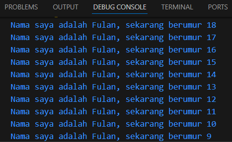

# Pemrograman Mobile Pertemuan Minggu 2

| Nama  :   | Haidar Aly |
| :--------: | :-------: |

| Kelas :  | TI-3F    |
| :--------: | :-------: |

| Absen : |  09  |
| :--------: | :-------: |

| NIM   :  | 2241720258   |
| :--------: | :-------: |

## Soal 1
### Syntax dart
```
void main() {
  for (int i = 0; i < 10;i++){
    print('Nama saya adalah Fulan, sekarang berumur ${18 - i}');
  }
}
```
### Output dart


## Soal 2
```
Dart perlu dipelajari sebelum Flutter karena merupakan bahasa dasar yang digunakan oleh Flutter, sehingga memahami Dart membantu dalam memahami struktur, sintaks, dan pola yang digunakan dalam pengembangan aplikasi. Dengan menguasai Dart, pengembang dapat lebih efisien dalam menulis logika aplikasi, mengelola state, dan menangani pemrograman asinkron.
```

## Soal 3
```
- Fitur Dart: Dart memiliki tooling yang produktif, garbage collection, dan dukungan tipe statis (meski opsional), serta mendukung lintas platform (web dan native). Fitur ini membuatnya aman dan efisien untuk pengembangan aplikasi.

- Evolusi Dart: Dikembangkan sejak 2011, Dart awalnya fokus pada pengembangan web tetapi kini lebih diarahkan untuk pengembangan aplikasi mobile, khususnya dengan Flutter. Dart menawarkan performa tinggi dan fleksibilitas dengan dukungan untuk OOP.

- Cara Kerja Dart: Dart dapat dieksekusi melalui Virtual Machine (VM) atau dikompilasi menjadi JavaScript. Terdapat dua mode kompilasi: Just-In-Time (JIT) untuk pengembangan dan debugging, serta Ahead-Of-Time (AOT) untuk performa optimal dalam produksi.

- Struktur Bahasa Dart: Dart mendukung OOP, dengan fitur seperti encapsulation, inheritance, dan polymorphism. Dart juga memiliki operator standar untuk operasi aritmatika, logika, dan relasional yang mirip dengan bahasa lain, serta fitur tambahan seperti increment/decrement dan operator shortcut.
```
